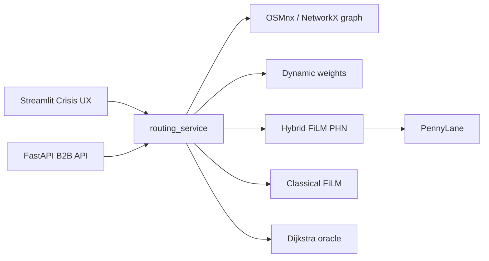

# QuantumRelief

**Quantum Intelligence. Human Relief.**

Team 5 — **Quantrio** · QC4SG SEA Hackathon

[](https://quantumrelief.streamlit.app)
[](runtime.txt)
[](https://pennylane.ai)
[](LICENSE)

Live demo: **[quantumrelief.streamlit.app](https://quantumrelief.streamlit.app)**

**Tagline:** Hybrid delivers near-Dijkstra quality with quantum-classical local inference.

---

## Overview

QuantumRelief predicts **next-hop emergency escape routes** on the Manila **Intramuros** road network under expanding earthquake and exit-traffic hazards. A **Hybrid Quantum–Classical FiLM** model (PennyLane PHN) is the hero path; Classical FiLM is an ablation; Dijkstra is the full-information optimal baseline.

Adapted from Haboury et al., *[Quantum Machine Learning for Disaster Response](https://arxiv.org/abs/2307.15682)* (Furubira → Manila). Surfaces: **Streamlit Crisis UX** + **FastAPI B2B Quantum Routing API**.

### Results (latest retrain)

From `data/retrain_report.json` — Hybrid vs Classical vs Dijkstra (24 route trials).

| Metric | Hybrid | Classical | Dijkstra |
| --- | --- | --- | --- |
| Val accuracy | ≈ **0.922** | ≈ **0.875** | — |
| Mean travel time | ≈ **9.78** | ≈ **10.85** | ≈ **9.98** |
| Exit reached | **100%** | **100%** | **100%** |
| Path overlap vs Dijkstra | ≈ **71.4%** | ≈ **64.3%** | — |
| Quantum contribution | ≈ **37.9%** | — | — |

Hybrid beats Classical on ≈ **91.7%** of trials and stays near Dijkstra on ≈ **95.8%**. Checkpoints: `film_hybrid.pt`, `film_classical.pt` (`demo_mode=False`).

### Quantum Contribution (≈37.9%)

Live metric from `HybridFiLMNetwork.combine` (`Linear(10→5)`), not a hardcoded slide number:

```
W = model.combine.weight          # shape (5, 10)
c_mag = mean(|W[:, 0:5]|)         # classical FiLM columns
q_mag = mean(|W[:, 5:10]|)        # PennyLane quantum columns
Quantum Contribution % = 100 × q_mag / (c_mag + q_mag)
```

Implemented in `src/quantum_hybrid.py` → `estimate_quantum_contribution_pct`. Streamlit expander **What is Quantum Contribution?** shows the same formula.

### Latency note

On Calculate, the UI times Hybrid / Classical / Dijkstra path rollouts (ms). **Hybrid is slower on classical simulators** (`PennyLane default.qubit`). Roadmap: a **real QPU** accelerates complex routing operators while Classical FiLM remains the production fallback.

### Quantum Advantage stress scenarios

Hard start / epicenter / exit pairs (Hybrid ≈ Dijkstra, Classical diverges) live in `data/demo_scenarios.json`. Regenerate:

```bash
python -u scripts/find_advantage_scenarios.py 60 5 42
```

Streamlit sidebar: **Load Quantum Advantage scenario** → auto-runs 3-way compare. Judge glance: **bold green ≠ cyan**, green close to **dashed** Dijkstra.

---

## Key features

- **Hybrid QML hero** — PennyLane PHN FiLM; **bold green** path on the map
- **Classical FiLM ablation** — **cyan** overlay (same FiLM, no quantum branch)
- **Dijkstra baseline** — **dashed** overlay with full Algorithm 1 dynamic weights
- **3-way metrics** — travel time, exit reached, path overlap, quantum contribution, **inference latency (ms)**
- **Quantum Advantage scenarios** — curated hard cases in the Streamlit sidebar
- **Dynamic hazards** — expanding \(r_{epi}\) / \(r_{exit}\) rings scrubbed by simulation time `t`
- **Crisis UX** — Folium map-click Start / Epicenter / Exit
- **B2B API** — FastAPI `/api/v1/calculate_route` with optional Classical / Dijkstra fields
- **Offline-ready** — cached GraphML, dataset, and trained checkpoints shipped in-repo

---

## Architecture



| Paper (Furubira) | QuantumRelief (Manila) |
| --- | --- |
| OSMnx city graph | Intramuros bbox, degree-capped, cached GraphML |
| 3 exits + random epicenter | Perimeter exits + map-click epicenter |
| Algorithm 1 dynamic weights | `src/dynamic_simulation.py` |
| Table I input size 36 | Same layout, local km projection |
| Classical + Quantum FiLM PHN | Classical ablation + **Hybrid QML hero** + Dijkstra baseline |

Radii: \(r_{epi} = 0.5 + \sqrt{0.0002\, t}\), \(r_{exit} = \sqrt{0.00075\, t}\).

Neighbor logits are masked to real degree; near-ties break toward the live Dijkstra next hop; a light Dijkstra assist may finish a stalled path — branding remains **Hybrid QML**. Travel times are honest path sums (never forged).

---

## Quick start — Streamlit

```bash
cd QuantumRelief
python3 -m venv .venv
source .venv/bin/activate
pip install -r requirements.txt
streamlit run app.py
```

Graph, dataset, and checkpoints under `data/` and `models/` are included. OSM download runs only if the GraphML cache is missing.

---

## Quantum Routing API — FastAPI

```bash
source .venv/bin/activate
pip install -r requirements.txt
pip install -r requirements-api.txt
uvicorn api:app --reload --host 0.0.0.0 --port 8000
```

```bash
curl -s http://127.0.0.1:8000/

curl -s -X POST http://127.0.0.1:8000/api/v1/calculate_route \
  -H "Content-Type: application/json" \
  -d '{
    "start_coords": [14.5895, 120.9750],
    "epicenter_coords": [14.5850, 120.9780],
    "exit_coords": [14.5920, 120.9720],
    "include_comparison": true
  }'
```

OpenAPI docs: [http://127.0.0.1:8000/docs](http://127.0.0.1:8000/docs)

---

## How to use (Crisis UX)

1. Sidebar: set click mode **Start → Epicenter → Exit** *(or load a Quantum Advantage scenario)*
2. **Click the Folium map** (Start/Exit snap to nearest road node)
3. Keep comparison overlays ON (**bold green** Hybrid · **cyan** Classical · **dashed** Dijkstra)
4. Press **Calculate Escape Route**
5. Scrub simulation time **`t`** — red \(r_{epi}\) / yellow \(r_{exit}\) expand
6. Read the **3-way dashboard**: travel times, quantum contribution formula, latency (ms)

In-app: expander **How to use QuantumRelief**, **What is Quantum Contribution?**, sidebar **How to use**.

Optional VN: *Chọn mode → click bản đồ → Calculate → kéo slider `t`.*

---

## Project structure

```
QuantumRelief/
  runtime.txt              # Streamlit Cloud: python-3.11
  requirements.txt         # Cloud / Streamlit (numpy → torch → pennylane)
  requirements-api.txt     # FastAPI + uvicorn
  app.py                   # Crisis UX — 3-way Hybrid / Classical / Dijkstra
  api.py                   # B2B Quantum Routing API
  data/                    # GraphML + routing_dataset.npz + retrain_report.json
                           # + demo_scenarios.json (Quantum Advantage picks)
  models/                  # film_classical.pt, film_hybrid.pt
  src/
    graph_setup.py         # OSMnx / NetworkX / exits
    dynamic_simulation.py  # Algorithm 1 weights
    dataset_generation.py  # Table I vectors + Dijkstra labels
    film_model.py          # Classical FiLM
    quantum_hybrid.py      # PennyLane Hybrid PHN (+ quantum contribution %)
    routing_service.py     # Shared Hybrid + Classical + Dijkstra (API + app)
  scripts/
    retrain_models.py
    find_advantage_scenarios.py  # Search / save hard demo scenarios
    generate_pitch_deck.py
```

---

## Models & data

| Asset | Role |
| --- | --- |
| `models/film_hybrid.pt` | Hybrid QML FiLM (PennyLane PHN) — demo hero |
| `models/film_classical.pt` | Classical FiLM ablation |
| `data/manila_intramuros_graph.graphml` | Cached Intramuros road graph |
| `data/routing_dataset.npz` | Training / eval samples |
| `data/retrain_report.json` | Val acc + 3-way route smoke metrics |
| `data/demo_scenarios.json` | Curated Quantum Advantage stress scenarios |

**Retrain** (CPU-bound Hybrid; periodic checkpoints saved mid-run):

```bash
source .venv/bin/activate
python -u scripts/retrain_models.py 500 120 12 8 3500
# args: episodes classical_epochs hybrid_A hybrid_B hybrid_max_samples
```

**Smoke checks:**

```bash
python -c "from src.quantum_hybrid import quantum_status, load_hybrid_model; print(quantum_status()); load_hybrid_model()"
python -c "from src.graph_setup import load_or_build_graph; print(load_or_build_graph().number_of_nodes())"
```

---

## Deploy (Streamlit Community Cloud)

1. Push to GitHub (`meolen07/QuantumRelief`)
2. [share.streamlit.io](https://share.streamlit.io) → select repo → deploy / reboot if deps changed
3. Confirm logs: Python **3.11** (`runtime.txt`), `numpy` before `torch`, PennyLane import OK

Cloud pins live in **`requirements.txt`**. API deps stay in **`requirements-api.txt`** so Cloud stays lean.

Keep `numpy==1.26.4` before `torch==2.2.2` for Cloud ABI safety. If PennyLane install times out, Classical FiLM still runs; Hybrid shows unavailable.

---

## Team

**Quantrio** (Team 5) · QC4SG — SEA Hackathon  
Manila Intramuros emergency routing with Hybrid QML.

---

## Citation

Haboury et al., *A Hybrid Quantum-Classical Neural Network for Disaster Response*, [arXiv:2307.15682](https://arxiv.org/abs/2307.15682). QuantumRelief adapts the Furubira FiLM / PHN pipeline to Manila Intramuros.
