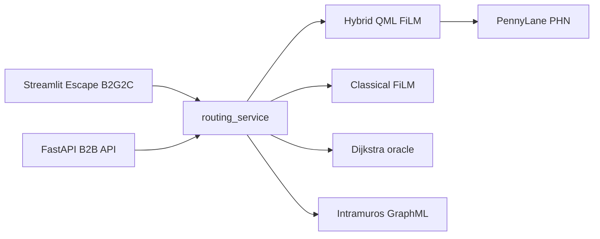

# QuantumRelief

**Quantum Intelligence. Human Relief.**

Team 5 — **Quantrio** · QC4SG SEA Quantathon 2026

[](https://quantumrelief.streamlit.app)
[](runtime.txt)
[](https://pennylane.ai)
[](LICENSE)

Live demo: **[quantumrelief.streamlit.app](https://quantumrelief.streamlit.app)**

**Tagline:** Hybrid delivers near-Dijkstra quality with quantum-classical local inference.

---

## Overview

QuantumRelief is a **B2G2C Escape-only** demo: emergency escape routing on the Manila **Intramuros** road network under expanding earthquake and exit-traffic hazards. A **Hybrid Quantum–Classical FiLM** model (PennyLane PHN) is the hero path; Classical FiLM is an ablation; Dijkstra is the full-information optimal baseline.

Adapted from Haboury et al., *[Quantum Machine Learning for Disaster Response](https://arxiv.org/abs/2307.15682)* (Furubira → Manila).

**One surface**

| Surface | Audience | Role |
| --- | --- | --- |
| **Escape** | Citizens + gov demos (B2G2C) | Your location → random epicenter → auto-best exit → Hybrid · Classical · Dijkstra |

`src/god_view.py` remains in-repo for optional command-center experiments but is **not** wired into the Streamlit UI.

**UI palette:** deep navy · **cyan** Hybrid · **gold** Classical · orange accents · **red** hazard · white/light dashed Dijkstra.

---

## Results (latest hard retrain)

From `data/retrain_report.json` — hard fine-tune (`λ_safe=0.35`, hard seeds) on serving Hybrid; fair eval **28** trials (hard_seeds + random).

| Metric | Hybrid | Classical | Dijkstra |
| --- | --- | --- | --- |
| Val accuracy | ≈ **0.883** | ≈ **0.886** | — |
| Mean travel time | ≈ **13.65** | ≈ **14.40** | ≈ **12.29** |
| Mean safety score | ≈ **0.89** | ≈ **0.87** | ≈ **0.94** |
| Exit reached | **100%** | **100%** | **100%** |
| Path overlap vs Dijkstra | ≈ **59.0%** | ≈ **49.3%** | — |
| Quantum contribution | ≈ **77.6%** | — | — |

Hybrid **mean travel ≤ Classical** (Δ ≈ −0.75) with **~78.6%** strict travel wins and **~78.6%** near Dijkstra. Mean safety also edges Classical. Serving: `models/film_hybrid.pt` (promoted from hardft).

**Safety score** (path rollout, higher = safer):

```
safety_score = min_epi_km − 0.15 · mean(log1p(w_edge))
```

- `min_epi_km` — closest km approach of any path node to the epicenter (primary; matches map rings)  
- `mean_epi_km` — also reported; mean alone can mis-rank paths that dive near epi then run a long far tail  
- `w_edge` — Algorithm-1 travel weight on each hop (light secondary hazard penalty)  
- Training uses a related idea via `λ_safe · L_safe` in `src/safety_loss.py` (soft preference for safer next hops; Dijkstra CE stays primary)

**Promotion rule:** copy candidate → `film_hybrid.pt` only when mean travel ≤ Classical, **or** travel within 2% of Classical **and** mean safety clearly higher.

### Quantum Contribution (≈77.6%)

Live metric from `HybridFiLMNetwork.combine` (`Linear(10→5)`):

```
W = model.combine.weight          # shape (5, 10)
c_mag = mean(|W[:, 0:5]|)         # classical FiLM columns
q_mag = mean(|W[:, 5:10]|)        # PennyLane quantum columns
Quantum Contribution % = 100 × q_mag / (c_mag + q_mag)
```

Implemented in `src/quantum_hybrid.py` → `estimate_quantum_contribution_pct`.

### Latency note

On **Find route**, the UI times Hybrid / Classical / Dijkstra rollouts (ms). **Hybrid is slower on classical simulators** (`PennyLane default.qubit`). Roadmap: a **real QPU** accelerates complex operators; Classical FiLM remains the production fallback.

### Quantum Advantage stress scenarios

Hard start / epicenter / exit pairs live in `data/demo_scenarios.json`. Regenerate:

```bash
python -u scripts/find_advantage_scenarios.py 60 5 42
```

---

## Key features

- **Hybrid QML hero** — PennyLane PHN FiLM; **cyan** path on the map
- **Classical FiLM ablation** — **gold** overlay (same FiLM, no quantum branch)
- **Dijkstra baseline** — **white dashed** overlay with full Algorithm 1 dynamic weights
- **3-way metrics** — travel time, exit reached, path overlap, quantum contribution, latency (ms)
- **Auto-best exit** — silent ranking; one recommended-exit line in the panel
- **Location** — Folium map click, snapped to nearest graph node
- **Epicenter** — **Random epicenter** only
- **Dynamic hazards** — expanding \(r_{epi}\) / \(r_{exit}\) rings scrubbed by simulation time `t`
- **B2G2C Escape UI** — Folium 2D · left ~2/3 map · right ~1/3 scrollable panel
- **B2B API** — FastAPI `/api/v1/calculate_route` with optional Classical / Dijkstra fields
- **Offline-ready** — cached GraphML, dataset, and trained checkpoints shipped in-repo

---

## Architecture


```mermaid
flowchart LR
  UX[Streamlit Escape B2G2C] --> RS[routing_service]
  API[FastAPI B2B API] --> RS
  RS --> H[Hybrid QML FiLM]
  RS --> C[Classical FiLM]
  RS --> D[Dijkstra oracle]
  H --> PL[PennyLane PHN]
  RS --> G[Intramuros GraphML]
```

---

## Quick start

```bash
source .venv/bin/activate
pip install -r requirements.txt
streamlit run app.py
```

Optional API:

```bash
pip install -r requirements-api.txt
uvicorn api:app --host 0.0.0.0 --port 8000
```

```bash
curl -s http://127.0.0.1:8000/api/v1/calculate_route \
  -H "Content-Type: application/json" \
  -d '{
    "start_coords": [14.5895, 120.9750],
    "epicenter_coords": [14.5850, 120.9780],
    "exit_coords": [14.5920, 120.9720],
    "include_comparison": true
  }'
```

OpenAPI docs: [http://127.0.0.1:8000/docs](http://127.0.0.1:8000/docs)

Graph, dataset, and checkpoints under `data/` and `models/` are included. OSM download runs only if the GraphML cache is missing.

---

## How to use — Escape (B2G2C)

1. **Click the map** to set your location — snapped to the nearest road node
2. Press **Random epicenter**
3. Read the **Best exit** line (auto-recommended)
4. Press **Find route** — **cyan** Hybrid · **gold** Classical · **white dashed** Dijkstra
5. Scrub hazard time **`t`** — red \(r_{epi}\) / gold \(r_{exit}\) expand
6. Read right-panel **3-way metrics**: travel times, quantum contribution, latency

Layout: left **~2/3** Folium map (fixed) · right **~1/3** scrollable controls + metrics.

---

## Project structure

```
QuantumRelief/
  runtime.txt              # Streamlit Cloud: python-3.11
  requirements.txt         # Cloud / Streamlit (numpy → torch → pennylane)
  requirements-api.txt     # FastAPI + uvicorn
  app.py                   # B2G2C Escape-only (Folium 2D)
  api.py                   # B2B Quantum Routing API
  data/                    # GraphML + routing_dataset.npz + retrain_report.json
                           # + demo_scenarios.json + hard_seeds.json
  models/                  # film_classical.pt, film_hybrid.pt
  src/
    graph_setup.py         # OSMnx / NetworkX / exits
    dynamic_simulation.py  # Algorithm 1 weights
    dataset_generation.py  # Table I vectors + Dijkstra labels
    film_model.py          # Classical FiLM
    safety_loss.py         # Safety aux loss (λ_safe · L_safe)
    quantum_hybrid.py      # PennyLane Hybrid PHN (+ quantum contribution %)
    routing_service.py     # Shared Hybrid + Classical + Dijkstra (API + app)
    god_view.py            # Unused by app (optional command-center experiments)
  scripts/
    retrain_models.py
    find_advantage_scenarios.py
    generate_pitch_deck.py
```

---

## Models & data

| Asset | Role |
| --- | --- |
| `models/film_hybrid.pt` | Hybrid QML FiLM (PennyLane PHN) — demo hero |
| `models/film_classical.pt` | Classical FiLM ablation |
| `data/manila_intramuros_graph.graphml` | Cached Intramuros road graph |
| `data/routing_dataset.npz` | Training / eval samples (~18.9k hard) |
| `data/retrain_report.json` | Val acc + 3-way route smoke metrics |
| `data/demo_scenarios.json` | Curated Quantum Advantage stress scenarios |
| `data/hard_seeds.json` | Classical-failure seeds for hard oversample |

**Hard retrain** (recommended; CPU-bound Hybrid; periodic checkpoints mid-run):

```bash
source .venv/bin/activate
# Hybrid push on existing hard dataset (~18.9k):
caffeinate -dimsu python -u scripts/retrain_models.py --hard --reuse-dataset \
  --skip-classical --hybrid-a 20 --hybrid-b 8 --hybrid-max-samples 6500 \
  --hard-repeats 6 --eval-trials 28 --lambda-safe 0.35
# Full regen + Classical + Hybrid:
caffeinate -dimsu python -u scripts/retrain_models.py --hard --episodes 1000 \
  --classical-epochs 100 --hybrid-a 20 --hybrid-b 8 --hybrid-max-samples 6500 \
  --lambda-safe 0.35
# Dataset only:
python -u scripts/retrain_models.py --hard --episodes 1000 --dataset-only
# Or via module:
python -u -m src.dataset_generation --episodes 1000 --hard
```

Hard mode widens earthquake/traffic radii (`hazard_intensity=2.0`) and oversamples seeds from `data/hard_seeds.json` (synced from `demo_scenarios.json` / `find_advantage_scenarios.py`) 8× mixed with random episodes. Hybrid subset additionally oversamples hard-seed trajectories at intensity 1.0 + 2.0.

**Smoke checks:**

```bash
python -c "from src.quantum_hybrid import quantum_status, load_hybrid_model; print(quantum_status()); load_hybrid_model()"
python -c "from src.graph_setup import load_or_build_graph; print(load_or_build_graph().number_of_nodes())"
```

---

## Deploy (Streamlit Community Cloud)

1. Push to GitHub (`meolen07/QuantumRelief`), including updated `models/*.pt` and `data/retrain_report.json`
2. [share.streamlit.io](https://share.streamlit.io) → select repo → **reboot the app** after model / dataset uploads so `@st.cache_resource` reloads checkpoints
3. Confirm logs: Python **3.11** (`runtime.txt`), `numpy` before `torch`, PennyLane import OK

Cloud pins live in **`requirements.txt`**. API deps stay in **`requirements-api.txt`** so Cloud stays lean.

Keep `numpy==1.26.4` before `torch==2.2.2` for Cloud ABI safety. If PennyLane install times out, Classical FiLM still runs; Hybrid shows unavailable.

---

## Team

**Quantrio** (Team 5) · QC4SG — SEA Quantathon 2026  
Manila Intramuros emergency routing with Hybrid QML.

---

## Citation

Haboury et al., *A Hybrid Quantum-Classical Neural Network for Disaster Response*, [arXiv:2307.15682](https://arxiv.org/abs/2307.15682). QuantumRelief adapts the Furubira FiLM / PHN pipeline to Manila Intramuros.
