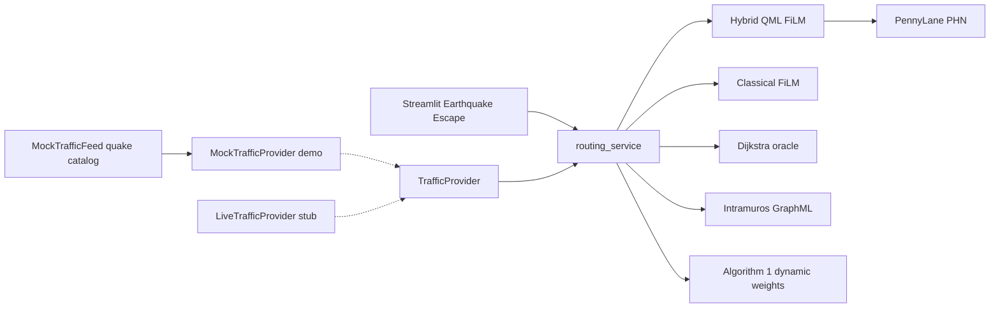

# QuantumRelief

**Quantum-inspired hybrid ML for earthquake escape.**

Team 5 — **Quantrio** · QC4SG SEA Quantathon 2026

[Streamlit](https://quantumrelief.streamlit.app)
[Python](runtime.txt)
[PennyLane](https://pennylane.ai)
[License](LICENSE)

Live demo: **[quantumrelief.streamlit.app](https://quantumrelief.streamlit.app)** (docs/TECHNICAL_QA.md)

**Tagline:** Quantum-inspired Hybrid FiLM∥PHN — safest & fastest evacuate exit under expanding hazard (simulated VQC today; hardware-ready later).

---

## Overview

You are in a Manila apartment when the ground shakes. You may know a few evacuate areas — not which is safest and fastest. **Earthquake Escape** ranks several exits, recommends the best, and routes you there while hazard rings expand with time `t`.

**Earthquake Escape** (Manila Intramuros) is the **Quantathon B2G2C flagship**. Epicenter / hazard rings + `t` scrub are primary. Post-quake damaged / blocked roads (and Ondoy-like flood as a related dynamic-hazard case) are secondary overlays — not a daily-commute product pitch.

A **quantum-inspired Hybrid QML** model — classical FiLM ∥ variational quantum circuit **simulated** on PennyLane `default.qubit` (PHN) — is the hero path; Classical FiLM is an ablation; Dijkstra is the full-information optimal baseline under Algorithm 1 dynamic weights. We do **not** claim real-time QPU execution or quantum supremacy.

Adapted from Haboury et al., *[Quantum Machine Learning for Disaster Response](https://arxiv.org/abs/2307.15682)* (Furubira → Manila).

**Honest scope today:** Manila OSM + **Live conditions · simulated feed** (`MockTrafficProvider` + `MockTrafficFeed` — quake-forward catalog: earthquake hazard + post-quake damage / flood). Same Earthquake Escape app in production with `LiveTrafficProvider` (TomTom / HERE stub; set `QR_TRAFFIC_MODE=live` + `TRAFFIC_API_KEY`). Value today = measurable **Hybrid vs Classical** ablation under earthquake dynamics — not hardware quantum speedup.

**Architecture:** `Demo = production app + MockTrafficFeed` · `Production = same app + LiveTrafficProvider`

**One surface**


| Surface                 | Audience                            | Role                                                                                                                      |
| ----------------------- | ----------------------------------- | ------------------------------------------------------------------------------------------------------------------------- |
| **Earthquake Escape**   | Citizens + city ops (B2G2C)         | Location → epicenter / hazard `t` → several ranked evacuate areas (recommend best) → Hybrid · Classical · Dijkstra on selected exit (travel + safety) · judge secondary |

**UI palette:** deep navy · **cyan** Hybrid · **gold** Classical · orange accents · **red** hazard · white/light dashed Dijkstra.

---

## Problem & solution


| Beat              | Story                                                                                                                 |
| ----------------- | --------------------------------------------------------------------------------------------------------------------- |
| **Problem**       | Static Dijkstra / A* fails when hazard expands and exits compete — citizens need safest & fastest escape, not A→B GPS. |
| **Flagship**      | Earthquake + evacuate-exit surge = Quantathon Earthquake Escape story.                                                |
| **Related case**  | Same dynamic-weight engine for post-quake damage / Ondoy-like flood corridors.                                        |
| **Solution**      | Dynamic edge weights + **quantum-inspired Hybrid FiLM∥PHN** (sim) local next-hop vs Classical ablation vs Dijkstra oracle (+ safety). |
| **Business**      | Ship **Earthquake Escape** proof now; grow civic / agency trust; optional routing API is later roadmap.                |


---

## Results (latest hard retrain)

From `data/retrain_report.json` — balance hard fine-tune (`λ_safe=0.32`, hard_frac=0.45, best **F16**) from `film_hybrid_pre_balance.pt`; fair eval **32** trials (hard_seeds + random).


| Metric                      | Hybrid      | Classical   | Dijkstra    |
| --------------------------- | ----------- | ----------- | ----------- |
| Val accuracy                | ≈ **0.920** | ≈ **0.886** | —           |
| Mean travel time            | ≈ **12.83** | ≈ **13.89** | ≈ **12.19** |
| Mean safety score (min-epi) | ≈ **0.51**  | ≈ **0.46**  | ≈ **0.56**  |
| Exit reached                | **100%**    | **100%**    | **100%**    |
| Path overlap vs Dijkstra    | ≈ **55.6%** | ≈ **51.0%** | —           |
| Quantum contribution        | ≈ **77.6%** | —           | —           |


Hybrid **mean travel ≤ Classical** (Δ ≈ −1.06) with **~75%** travel wins and **~81%** near Dijkstra. Mean **min-epi** safety also edges Classical (Δ ≈ +0.045). Catastrophic blowups (H travel > 1.25× C) ≈ **9.4%** (down from ~10.7%). **Promote: YES** — `film_hybrid_hardft.pt` → serving `models/film_hybrid.pt`. UI **HERO** badge only when Hybrid strictly beats Classical on travel, or travel-tie + higher safety.

### Pitch / Notion charts

See [`docs/RESULTS_CHARTS.md`](docs/RESULTS_CHARTS.md). Static PNGs (cyan Hybrid · gold Classical · grey Dijkstra) under `docs/assets/` — regenerate with:

```bash
.venv/bin/python scripts/generate_results_charts.py
```

Interactive comparison: Cursor canvas `quantumrelief-results.canvas.tsx` (open beside chat).

**Safety score** (path rollout, **min-epi based**, higher = safer; UI-scale ~0.05–2.0):

```
safety_score = min_epi_km − 0.15 · mean(log1p(w_edge))
```

- `min_epi_km` — closest km approach of any path node to the epicenter (**primary**; matches map rings)  
- `mean_epi_km` — also reported; mean alone can mis-rank paths that dive near epi then run a long far tail  
- `w_edge` — Algorithm-1 travel weight on each hop (light secondary hazard penalty)  
- Training uses a related idea via `λ_safe · L_safe` in `src/safety_loss.py` (soft preference for safer next hops; Dijkstra CE stays primary)

**Promotion rule:** copy candidate → `film_hybrid.pt` only when mean travel ≤ Classical (or travel within 2% + higher safety), mean safety ≥ Classical, and catastrophic rate (H>1.25×C) does not worsen.

### Quantum Contribution (≈77.6%)

Live metric from `HybridFiLMNetwork.combine` (`Linear(10→5)`):

```
W = model.combine.weight          # shape (5, 10)
c_mag = mean(|W[:, 0:5]|)         # classical FiLM columns
q_mag = mean(|W[:, 5:10]|)        # PennyLane quantum columns
Quantum Contribution % = 100 × q_mag / (c_mag + q_mag)
```

Implemented in `src/quantum_hybrid.py` → `estimate_quantum_contribution_pct`.

### Latency note

On **Find safest & fastest route**, the UI times Hybrid / Classical / Dijkstra rollouts (ms). **Hybrid is slower on classical simulators** (`PennyLane default.qubit`) — this is expected for quantum-*inspired* Hybrid QML today. Roadmap: hardware-ready PHN offload later; Classical FiLM remains the production fallback. We do **not** claim real-time QPU latency or supremacy.

### Quantum Advantage stress scenarios

Hard start / epicenter / exit pairs live in `data/demo_scenarios.json`. Regenerate:

```bash
python -u scripts/find_advantage_scenarios.py 60 5 42
```

---

## Key features

- **Quantum-inspired Hybrid QML hero** — classical FiLM ∥ PennyLane PHN (`default.qubit` sim); **cyan** path on the map
- **Classical FiLM ablation** — **gold** overlay (same FiLM, no quantum branch)
- **Dijkstra baseline** — **white dashed** overlay with full Algorithm 1 dynamic weights
- **3-way metrics** — travel time, safety, destination reached, path overlap, quantum contribution, latency (ms)
- **Mock Escape feed** — quake-forward named conditions (`as_of`, Manila time-of-day, earthquake + post-quake damage / flood) via `MockTrafficFeed`
- **Your location + several evacuate areas** — map click = apartment/start; top-N perimeter exits drawn + ranked (travel + safety); best recommended; user can override routing target
- **Epicenter + hazard `t`** — primary Escape controls (red rings); not an optional stress toy
- **Reliability fallback** — if Hybrid travel > 1.25× Classical (or Hybrid fails / very slow), serve Classical as primary with “Hybrid deferred · showing Classical” (no HERO)
- **Traffic badge** — **Live conditions · simulated feed** (honest) vs live feed stub
- **Run judge demo** — secondary Quantathon path (collapsed): curated corridor + pinned flood + auto escape route
- **Earthquake Escape UI** — Folium 2D · left ~2/3 map · right ~1/3 scrollable panel · English
- **Offline-ready** — cached GraphML, dataset, and trained checkpoints shipped in-repo
- **Cloud sync** — see [`CLOUD_UPLOAD.md`](CLOUD_UPLOAD.md)

---

## Architecture


```mermaid
flowchart LR
  UX[Streamlit Earthquake Escape] --> RS[routing_service]
  TP[TrafficProvider] --> RS
  Feed[MockTrafficFeed quake catalog] --> Mock
  Mock[MockTrafficProvider demo] -.-> TP
  Live[LiveTrafficProvider stub] -.-> TP
  RS --> H[Hybrid QML FiLM]
  RS --> C[Classical FiLM]
  RS --> D[Dijkstra oracle]
  H --> PL[PennyLane PHN]
  RS --> G[Intramuros GraphML]
  RS --> Dyn[Algorithm 1 dynamic weights]
```

**One-liner:** Demo = production Earthquake Escape + mock feed · Production = same Escape app + live provider. Hazard + post-quake damage flow Escape → `TrafficProvider` → `routing_service` → Algorithm 1.


---

## Quick start

```bash
source .venv/bin/activate
pip install -r requirements.txt
streamlit run app.py
# Badge shows: Live conditions · simulated feed (default — no traffic keys)
```

Switch traffic feed mode:

```bash
# Demo / Cloud / product (default) — MockTrafficFeed city conditions
QR_TRAFFIC_MODE=demo streamlit run app.py

# Live stub — fails gracefully without a key
QR_TRAFFIC_MODE=live streamlit run app.py

# Live stub with key present (empty overlay until TomTom/HERE is wired)
QR_TRAFFIC_MODE=live TRAFFIC_API_KEY=your_key streamlit run app.py
```

### Optional — developer routing API

Kept for later B2B experiments (not part of the Escape demo story):

```bash
pip install -r requirements-api.txt
uvicorn api:app --host 0.0.0.0 --port 8000
# OpenAPI: http://127.0.0.1:8000/docs
```

Graph, dataset, and checkpoints under `data/` and `models/` are included. OSM download runs only if the GraphML cache is missing.

---

## How to use as a product

Demo ≠ fake UI. **Demo = production Earthquake Escape + `MockTrafficProvider` / `MockTrafficFeed`.**

### Step-by-step (Earthquake Escape)

1. Open the app — product opens on **Earthquake Escape** (`quake_core`) with epicenter active and **several evacuate areas** ranked (best recommended). Badge: **Live conditions · simulated feed**.
2. **Your escape** — click the map to set **Your location** (apartment/start). Epicenter + **Hazard time t** are primary. Panel lists ranked exits with scores; override which area to route to if you already know candidates.
3. **Escape route** — press **Find safest & fastest escape route**. Engines compare for the **selected** exit. Hazard + post-quake damage apply to Hybrid, Classical, and Dijkstra the same way.
4. Read travel + safety in the panel. **HERO** appears only when Hybrid strictly wins (or travel-tie + higher safety). If Hybrid is catastrophic (>1.25× Classical), fails, or is very slow → **Hybrid deferred · showing Classical** (no HERO; Hybrid path faded).
5. Secondary: **Refresh feed** · post-quake damage overlays · collapsed arbitrary destination · collapsed **Run judge demo** (Quantathon / Ondoy-like flood).

Layout: left **~2/3** Folium map · right **~1/3** panel. No address field. Primary destination story = several evacuate areas (recommend safest & fastest; others stay visible).

### Mock feed scenarios

| Scenario id | What you see |
| ----------- | ------------ |
| `quake_core` / `quake_pasig` | **Primary** Earthquake Escape · hazard epi + soft ring penalties |
| `mixed_quake_flood` | Compound Escape · quake + flood |
| `quiet_morning` / `rush_hour_arterial` | Post-quake damaged roads (secondary) |
| `closure_walls` / `closure_historic` | Post-quake blocked corridors |
| `mixed_evening` | Damage + wall block mix |
| `night_quiet` | Sparse residual post-quake damage |
| `flood_pasig` | Related Ondoy-like flood case |
| `judge_flood` | Pinned Quantathon flood (judge demo only) |

Scenarios rotate by **Manila time-of-day** plus a 5-minute deterministic bucket. **Quake scenarios lead daytime pools.** **Refresh feed** advances the catalog manually.

### Architecture swap

| Mode | Provider | Env |
| ---- | -------- | --- |
| **Demo (default)** | `MockTrafficProvider` + `MockTrafficFeed` | `QR_TRAFFIC_MODE=demo` |
| **Production** | `LiveTrafficProvider` (TomTom/HERE stub) | `QR_TRAFFIC_MODE=live` + `TRAFFIC_API_KEY` |

Same Streamlit Escape app — only the feed provider changes.

---

## How to use — Quantathon judge path (secondary)

Collapsed **Run judge demo**: curated advantage corridor + pinned flood + mild epi + auto **Find safest & fastest escape route** → cyan Hybrid · gold Classical · white Dijkstra → **HERO** only on Hybrid win.
---

## Project structure

```
QuantumRelief/
  runtime.txt              # Streamlit Cloud: python-3.11
  requirements.txt         # Cloud / Streamlit (numpy → torch → pennylane)
  requirements-api.txt     # Optional FastAPI deps (developer; not demo path)
  app.py                   # Earthquake Escape product surface (Folium 2D)
  api.py                   # Optional routing API (kept for later; out of demo path)
  data/                    # GraphML + routing_dataset.npz + retrain_report.json
                           # + demo_scenarios.json + hard_seeds.json
  models/                  # film_classical.pt, film_hybrid.pt
  src/
    graph_setup.py         # OSMnx / NetworkX / exits
    dynamic_simulation.py  # Algorithm 1 weights (disaster = extreme dynamics)
    dataset_generation.py  # Table I vectors + Dijkstra labels
    film_model.py          # Classical FiLM
    safety_loss.py         # Safety aux loss (λ_safe · L_safe)
    quantum_hybrid.py      # PennyLane Hybrid PHN (+ quantum contribution %)
    routing_service.py     # Shared Hybrid + Classical + Dijkstra (Escape app)
    traffic_provider.py    # Mock vs Live provider (swap for production)
    mock_traffic_feed.py   # Named city conditions + Manila time-of-day pools
  CLOUD_UPLOAD.md          # Exact files + Streamlit Cloud verify checklist
  scripts/
    retrain_models.py
    find_advantage_scenarios.py
    generate_pitch_deck.py
```

---

## Models & data


| Asset                                  | Role                                        |
| -------------------------------------- | ------------------------------------------- |
| `models/film_hybrid.pt`                | Quantum-inspired Hybrid FiLM∥PHN (PennyLane sim) — demo hero |
| `models/film_classical.pt`             | Classical FiLM ablation                     |
| `data/manila_intramuros_graph.graphml` | Cached Intramuros road graph                |
| `data/routing_dataset.npz`             | Training / eval samples (~18.9k hard)       |
| `data/retrain_report.json`             | Val acc + 3-way route smoke metrics         |
| `data/demo_scenarios.json`             | Curated Quantum Advantage stress scenarios  |
| `data/hard_seeds.json`                 | Classical-failure seeds for hard oversample |


**Hard retrain** (recommended; CPU-bound Hybrid; periodic checkpoints mid-run):

```bash
source .venv/bin/activate
# Hybrid push on existing hard dataset (~18.9k):
caffeinate -dimsu python -u scripts/retrain_models.py --hard --reuse-dataset \
  --skip-classical --hybrid-a 20 --hybrid-b 8 --hybrid-max-samples 6500 \
  --hard-repeats 6 --eval-trials 28 --lambda-safe 0.35
# Full regen + Classical + Hybrid:
caffeinate -dimsu python -u scripts/retrain_models.py --hard --episodes 1000 \
  --classical-epochs 100 --hybrid-a 20 --hybrid-b 8 --hybrid-max-samples 6500 \
  --lambda-safe 0.35
# Dataset only:
python -u scripts/retrain_models.py --hard --episodes 1000 --dataset-only
# Or via module:
python -u -m src.dataset_generation --episodes 1000 --hard
```

Hard mode widens earthquake/traffic radii (`hazard_intensity=2.0`) and oversamples seeds from `data/hard_seeds.json` (synced from `demo_scenarios.json` / `find_advantage_scenarios.py`) 8× mixed with random episodes. Hybrid subset additionally oversamples hard-seed trajectories at intensity 1.0 + 2.0.

**Smoke checks:**

```bash
python -c "from src.quantum_hybrid import quantum_status, load_hybrid_model; print(quantum_status()); load_hybrid_model()"
python -c "from src.graph_setup import load_or_build_graph; print(load_or_build_graph().number_of_nodes())"
```

---

## Business & roadmap


| Horizon   | Focus                                                                                                                                      |
| --------- | ------------------------------------------------------------------------------------------------------------------------------------------ |
| **Now**   | Earthquake Escape + Hybrid / Classical / Dijkstra · `MockTrafficProvider` (quake-forward demo default) |
| **Next**  | Wire `LiveTrafficProvider` to TomTom / HERE · multi-district graphs · civic Escape pilots             |
| **Later** | Optional B2B routing API · real QPU offload · offline edge · SEA city transfer · fuller B2G2C Escape  |


---

## Deploy (Streamlit Community Cloud)

1. Push to GitHub (`meolen07/QuantumRelief`), including updated `models/*.pt` and `data/retrain_report.json`
2. [share.streamlit.io](https://share.streamlit.io) → select repo → **reboot the app** after model / dataset uploads so `@st.cache_resource` reloads checkpoints
3. Confirm logs: Python **3.11** (`runtime.txt`), `numpy` before `torch`, PennyLane import OK

Cloud pins live in `**requirements.txt`**. Optional API deps stay in `**requirements-api.txt**` (not needed for Cloud Escape demo).

Keep `numpy==1.26.4` before `torch==2.2.2` for Cloud ABI safety. If PennyLane install times out, Classical FiLM still runs; Hybrid shows unavailable.

---

## Team

**Quantrio** (Team 5) · QC4SG — SEA Quantathon 2026  
Nicole Margareth Sibal

Rairolf Rabang

Huynh Mai Linh Nguyen

---

## Citation

Haboury et al., *A Hybrid Quantum-Classical Neural Network for Disaster Response*, [arXiv:2307.15682](https://arxiv.org/abs/2307.15682). QuantumRelief adapts the Furubira FiLM / PHN pipeline to Manila Intramuros; Earthquake Escape is the Quantathon flagship.
